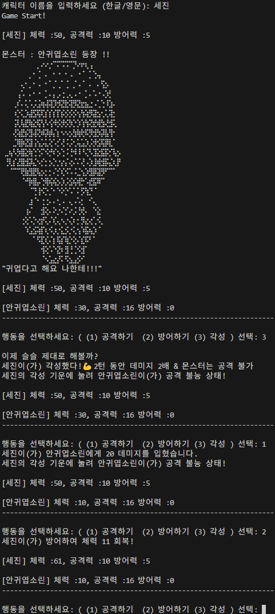

# 콘솔 RPG 게임 (Dart)

##  프로젝트 소개
이 프로젝트는 Dart 언어로 개발된 텍스트 기반 콘솔 RPG 게임입니다.  
사용자는 캐릭터 이름을 입력하고, 세 몬스터(귀엽서연, 뽀뽀상록, 안귀엽소린)와 차례로 전투를 벌이며  
공격/방어/각성 기능을 활용해 최종 승리를 목표로 합니다.  
도트 이미지와 대사 출력 등으로 텍스트 기반임에도 몰입감 있는 전투(?)를 구현했습니다.

---

##  주요 기능
- 캐릭터 이름 입력 + 능력치 불러오기 (characters.txt)
- 전투 중 행동 선택: `공격 / 방어 / 각성` 
- 각성 시 2턴 동안 공격력 2배 + 몬스터 공격 차단
- 몬스터 방어력 3턴마다 2씩 증가
- 게임 결과 저장 (`result.txt`)
- 몬스터별 도트 텍스트 아트 출력
- 30% 확률로 시작 시 보너스 체력 +10 제공

---

##  사용 기술
 

---

##  실행 환경
- Dart SDK 3.5.3
- 콘솔 기반 실행 (예: `dart run`)

## 실행 화면
 

## 프로젝트 구조
- **bin/rpg_console.dart**  
  애플리케이션의 메인 진입점입니다.  
  사용자로부터 캐릭터 이름을 입력받고, `Game` 클래스를 실행하여 전체 게임을 진행합니다.

- **lib/game.dart**  
  - `Game` 클래스:  
    게임의 전체 진행을 담당합니다.  
    몬스터 등장, 전투 흐름, 결과 저장, 도트 출력, 각성 시스템 등을 제어합니다.

- **lib/character.dart**  
  - `Character` 클래스:  
    사용자 캐릭터를 정의하며, 공격, 방어, 각성 등의 기능과 상태 정보를 포함합니다.  
    게임 시작 시 텍스트 파일로부터 스탯을 불러오고, 이름은 콘솔에서 직접 입력받습니다.

- **lib/monster.dart**  
  - `Monster` 클래스:  
    각 몬스터의 정보 및 전투 기능을 정의합니다.  
    텍스트 파일에서 여러 몬스터를 불러오며, 등장 대사와 도트 텍스트 출력 기능도 포함합니다.

- **lib/entity.dart**  
  - `Entity` 추상 클래스:  
    `Character`와 `Monster`의 공통 속성(이름, 체력, 공격력, 방어력)과 기본 메서드를 정의합니다.

- **assets/**  
  - `characters.txt`: 캐릭터의 초기 능력치 (체력, 공격력, 방어력)를 저장하는 파일입니다.  
  - `sorin.txt`, `sangrok.txt`, `seoyeon.txt`:  
    각 몬스터의 도트 텍스트 파일로, 등장 시 터미널에 출력됩니다.

- **result.txt**  
  게임 종료 후 결과가 저장되는 파일입니다.  
  캐릭터 이름, 남은 체력, 게임 결과(승리/패배/중도 종료)가 기록됩니다.
